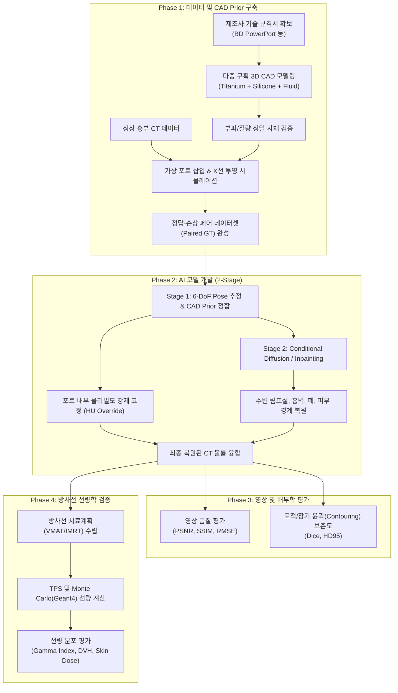

# [연구 계획서] 제조사 규격 3D CAD Prior 및 딥러닝 기반 케모포트 금속 아티팩트 저감(MAR)과 방사선 선량 무결성 검증

---

## 1. 연구 개요 및 배경 (Background)

* **연구 제목(가제):** *Prior-guided Deep Learning for Multi-material Chemo Port Metal Artifact Reduction and Dosimetric Accuracy in Breast Cancer Radiation Therapy*
* **연구 배경:**
  * 전 세계적으로 케모포트의 약 60%는 여전히 고밀도 금속인 **티타늄(Titanium)** 재질로 사용됨.
  * 유방암 방사선 치료(특히 쇄골상부 림프절[SCN], 내유림프절, 흉벽 치료) 시 케모포트 주변에 심각한 CT 아티팩트(광자 결핍, 선속 경화 줄무늬) 발생.
  * 케모포트는 **피부 표면 바로 아래(Subcutaneous)** 및 **폐(저밀도 공기강)** 경계면에 인접하여, 기존 상용 MAR(iMAR, O-MAR, SEMAR) 적용 시 계면 왜곡 및 2차 암영 발생.
  * 케모포트는 단순 금속 덩어리가 아닌 **[티타늄 본체 + 실리콘 격막 + 내부 유체 약실]**의 다중 물질 복합체로, 내부 밀도 불균질성을 무시하고 통짜 금속으로 처리할 경우 심각한 방사선 선량 계산(TPS) 왜곡 초래.

---

## 2. 연구의 핵심 독창성 (Key Novelties)

1. **공식 레퍼런스 가이드 기반의 다중 물질(Multi-material) 3D CAD Prior 구축**
   * 고가의 마이크로 CT 촬영 없이, 제조사(BD, B.Braun 등)의 공식 기술 사양서(Specification Sheet)를 기반으로 외형 및 내부 챔버가 분리된 표준 3D 파라메트릭 CAD 모델 확보.
   * 부피(Reservoir Volume)와 질량(Mass) 검증을 통한 물리적 정합성 보장.
2. **Prior-guided 2-Stage Deep Learning Framework**
   * **Stage 1 (자세 추정 및 포트 내부 고정):** 아티팩트가 심한 환자 CT에서 포트의 6-자유도(6-DoF) 위치와 회전을 추정하여 CAD Prior를 정확히 정합, 포트 내부의 다중 구획 밀도를 물리적으로 100% 확정.
   * **Stage 2 (조건부 인페인팅):** 진짜 포트 외벽과 주변 정상 조직(흉벽, 늑골, 폐, 피부선)을 조건(Condition)으로 주는 Diffusion/Transformer 기반 모델로 줄무늬를 제거하고 림프절/해부학적 경계선 복원.
3. **방사선 치료 선량학적 무결성(Dosimetric Integrity) 검증**
   * 단순 영상 품질 지표(PSNR, SSIM)에 머무르지 않고, 치료계획 시스템(TPS) 및 **몬테카를로 시뮬레이션(Geant4)** 기반 선량 비교(Gamma pass rate, DVH 분석) 수행.

---

## 3. 전체 연구 파이프라인 (4-Phase Pipeline)

---

## 4. 세부 연구 단계별 실행 방안

### Phase 1: 3D CAD 모델링 및 데이터셋 생성
1. **CAD 모델링:**
   * 선정 대상: 임상 점유율 1위인 *BD PowerPort® Titanium* 또는 *B.Braun Celsite®*.
   * 분리 파트:
     * Part 1: 티타늄 외벽 및 바닥 ($\rho = 4.43\text{ g/cm}^3$)
     * Part 2: 실리콘 격막(Septum) ($\rho = 1.15\text{ g/cm}^3$)
     * Part 3: 유체 챔버(Fluid Cavity) ($\rho = 1.0\text{ g/cm}^3$, 식염수 충만 상태 모사)
   * 검증: CAD 상의 챔버 체적($V_{\text{fluid}}$)이 스펙상 용적($0.6\text{ mL}$)과 일치하는지, 총 질량이 표기 중량($7.5\text{ g}$)과 일치하는지 확인.
2. **가상 포트 삽입(Virtual Port Insertion) 데이터셋 구축:**
   * 포트가 없는 정상 흉부 CT(Clean CT) 수집.
   * 피하층 쇄골 하부에 다양한 각도/깊이로 CAD 모델 가상 삽입.
   * 순방향 투영(Forward Projection) 및 선속 경화, 포톤 노이즈, 산란선을 시뮬레이션하여 실제 CT와 동일한 금속 아티팩트 유발 $\rightarrow$ **완벽한 지도학습용 정답-손상 페어(Pair) 데이터 구축**.

### Phase 2: AI 아키텍처 설계
* **Stage 1 (Rigid CAD Alignment):**
  * 포트의 중심점 및 회전(Yaw, Pitch, Roll)을 회귀(Regression)하는 가벼운 3D CNN 기반 네트워크.
  * 아티팩트로 번진 이미지 속에서 CAD 템플릿의 진짜 경계를 확정하고 내부를 실제 밀도로 치환.
* **Stage 2 (Context-Aware Inpainting Diffusion Model):**
  * 포트 경계면 외곽의 아티팩트 영역을 마스킹.
  * 비손상 흉곽 구조, 늑골, 폐실질, 피부 라인을 가이드 조건으로 인페인팅 수행.
  * 상용 MAR이 취약한 '피부-공기', '흉벽-폐' 경계면의 급격한 밀도 변화를 매끄럽고 물리적으로 타당하게 복원.

### Phase 3 & 4: 임상 및 방사선물리적 평가
1. **영상학적 평가:**
   * 기존 상용 기법(Uncorrected vs iMAR/O-MAR vs 제안한 AI 모델) 비교.
   * PSNR, SSIM, MAE 측정.
   * 쇄골상부 림프절(SCN Level II/III) 및 폐 경계선의 오차 거리(Hausdorff Distance) 측정.
2. **방사선 선량학적 평가 (논문의 핵심 셀링 포인트):**
   * 유방암 림프절 포함 방사선 치료계획(VMAT / Tangential IMRT) 생성.
   * **평가 지표:**
     * 포트 후방 저선량(Cold spot) 해소율
     * 포트 전방 및 피부 최대 선량(Hot spot) 감소율
     * 선량-체적 히스토그램(DVH): CTV $D_{95}$, PTV coverage, 동측 폐 $V_{20\text{Gy}}$, $V_{5\text{Gy}}$
     * 3차원 감마 분석(Gamma Pass Rate): $3\%/3\text{mm}$, $2\%/2\text{mm}$, $1\%/1\text{mm}$ 기준선 도달률 비교.

---

## 5. 전체 3부작 로드맵 연계성

* **제1탄: 케모포트 (본 연구)**
  * 주제: 단일 규격 금속체 + 피하/폐 경계면 + 다중 물질(Multi-material) CAD Prior
* **제2탄: 치아 보철물 (Dental Implants)**
  * 주제: 다발성(Clustered) 금속체 + 복잡한 골/공기강 구조 + 다방향 상호 줄무늬 제거
* **제3탄: 인공 고관절 (Femur/Hip Prosthesis)**
  * 주제: 대형 광자 결핍(Severe Photon Starvation) + 골반 심부 장기(방광/직장) 선량 붕괴 극복
