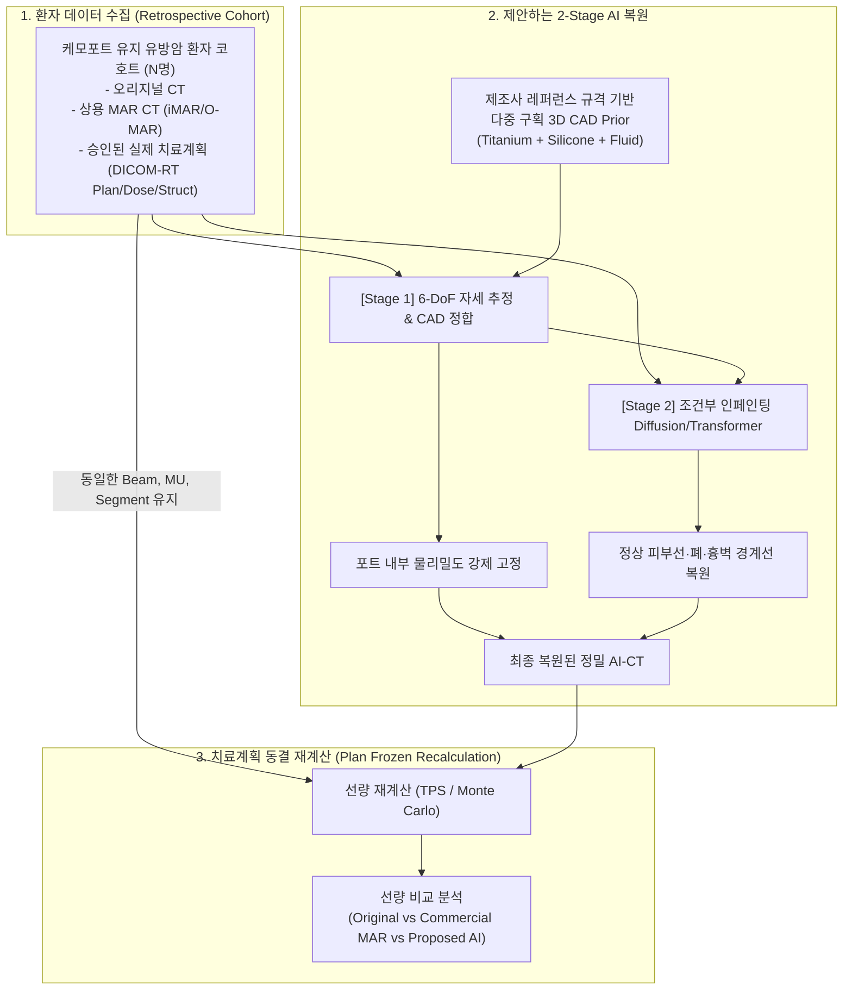

# [논문 계획서] 기치료 유방암 환자의 실제 치료계획 기반 케모포트 AI 인공음영 저감(MAR) 및 후향적 선량 재평가 연구

---

## 1. 논문 개요 (Paper Overview)

* **가제 (Working Title):**
  * **(국문)** 제조사 3D CAD Prior 기반 딥러닝 금속 인공음영 저감(MAR) 적용에 따른 케모포트 삽입 유방암 환자의 방사선 치료계획 선량 변화 후향적 평가
  * **(영문)** *Retrospective Dosimetric Evaluation of Breast Cancer Radiation Therapy with a Novel CAD Prior-Guided AI Metal Artifact Reduction for Patients with Chemo Ports*
* **연구 유형:** 후향적 임상-의학물리 융합 연구 (Retrospective Clinical & Dosimetric Study)
* **목표 저널군:** *Medical Physics*, *Radiotherapy and Oncology (Green Journal)*, *Physics in Medicine & Biology (PMB)*, 또는 *International Journal of Radiation Oncology • Biology • Physics (Red Journal)*

---

## 2. 연구 배경 및 핵심 가설 (Background & Hypothesis)

### 2.1 연구 배경 및 임상적 물음
* 유방암 환자 중 선행/수술 후 항암치료를 위해 케모포트(대부분 티타늄)를 삽입한 상태로 방사선 치료를 받는 빈도가 높음.
* 기존 임상 현장에서는:
  1. 아티팩트가 심한 CT 위에 그대로 계획을 세우거나,
  2. 상용 MAR(iMAR, O-MAR)로 대략 보정된 CT를 사용하거나,
  3. 포트 전체를 통째로 금속이나 물 밀도로 강제 지정(Bulk override)하여 치료계획을 승인해 왔음.
* **임상적 핵심 질문:** 
  > *"그렇다면, 우리가 과거에 이미 치료를 마친 그 환자들의 몸에는 실제로 선량이 얼마나 정확하게 들어갔던 것일까? 포트 뒤쪽 림프절에 선량 부족(Cold spot)이 있었거나, 피부에 원치 않는 과선량(Hot spot)이 전달되지는 않았을까?"*

### 2.2 연구 가설 (Hypothesis)
* 제조사 레퍼런스 가이드 기반 3D CAD Prior와 조건부 인페인팅 AI로 복원한 CT(진짜 인체 해부학 및 포트 내부 밀도가 반영된 CT) 위에 **기존에 승인된 동일한 치료 빔(MU, 각도, 세그먼트)을 그대로 재계산(Recalculation)**하면, 기존 치료계획 시스템(TPS)이 예측했던 선량과 임상적으로 유의미한 차이(표적 선량 부족 또는 피부 과선량)가 확인될 것이다.

---

## 3. 연구 재료 및 방법 (Materials and Methods)

### 3.1 환자 코호트 선정 (Patient Cohort)
* **대상:** 쇄골상부 림프절(SCN) 및 흉벽/유방을 포함하여 방사선 치료(VMAT 또는 3D-CRT/IMRT)를 완료한 환자 $N$명 (예: 20~30명).
* **수집 데이터:**
  * 모의치료 CT (Uncorrected 원본 및 상용 MAR 적용본).
  * 실제로 방사선 치료에 사용된 DICOM-RT (치료계획 Plan, 환자 윤곽 Structure, 계산된 선량 Dose).

### 3.2 제조사 레퍼런스 기반 3D CAD Prior 준비
* 환자에게 삽입된 포트 모델(예: *BD PowerPort® Titanium*)의 제조사 기술 규격서(Specification Sheet) 확보.
* 외벽 티타늄($\rho = 4.43\text{ g/cm}^3$), 실리콘 격막($\rho = 1.15\text{ g/cm}^3$), 내부 약실 챔버($\rho = 1.0\text{ g/cm}^3$)의 3개 파트로 분리된 파라메트릭 CAD 모델링.

### 3.3 2-Stage AI 복원 프로세스
1. **Stage 1 (자세 추정 및 CAD 모델 정합):**
   * 환자 CT의 아티팩트 속에서 6-DoF Pose 추정 네트워크가 CAD 모델을 3차원으로 오버레이.
   * 번진 금속 경계를 지우고, 포트 내부 구획을 실제 밀도로 정확히 치환.
2. **Stage 2 (조건부 인페인팅):**
   * 포트 외벽(Inner condition)과 정상 조직(Outer condition: 피부 표면, 늑골, 정상 폐 실질)을 조건으로 주입.
   * Diffusion/Transformer 모델을 통해 줄무늬를 제거하고 쇄골상부 림프절(SCN Level II/III), 피부 윤곽, 폐-흉막 경계를 본래 인체 해부학적 연속성에 맞게 복원 $\rightarrow$ **AI-MAR CT 생성**.

### 3.4 선량 재계산 방법 (Frozen-Plan Recalculation)
* **임상 핵심 테크닉:** 기존 치료계획의 파라미터(빔 각도, 콜리메이터 각도, 세그먼트 형태, 모니터 유닛[MU], 갠트리 회전 궤적 등)를 **단 $1\%$도 변경하지 않고 동결(Freeze)**.
* 동일한 계획을 다음 세 가지 CT 세트에 각각 올려 선량만 재계산(Forward calculation):
  1. $\text{Plan}_{\text{Orig}}$: 아티팩트가 있는 기존 오리지널 CT 선량 (치료 당시 계산치)
  2. $\text{Plan}_{\text{Comm}}$: 상용 MAR(iMAR 등) 적용 CT 선량
  3. $\text{Plan}_{\text{AI}}$: 본 연구의 CAD Prior AI 복원 CT 선량 (**실제 환자 몸에 들어간 진짜 선량의 기준점**)
  4. *(옵션)* Geant4 몬테카를로 시뮬레이션을 통한 물리적 정밀 벤치마크.

---

## 4. 정량적 평가 지표 (Evaluation Endpoints)

### 4.1 표적 윤곽 변화 및 선량 평가 (Two-Track Target Evaluation)
아티팩트로 인해 해부학적 구조(쇄골하혈관, 흉벽 근육선 등)가 가려져 치료 당시 타깃(CTV/PTV)이 왜곡되었을 가능성을 고려하여, **두 가지 트랙(Track A & B)**으로 나누어 정밀 평가합니다.

* **[Track A] 기하학적 표적 윤곽 오차 분석 (Contouring & Geometric Error):**
  * **배경:** 복원된 깨끗한 AI-CT에서 방사선종양학과 전문의가 ESTRO/RTOG 유방암 가이드라인에 따라 **'진짜 표적($\text{CTV}_{\text{True}}$, $\text{PTV}_{\text{True}}$)'**을 재설정(Re-contouring).
  * **평가 지표:**
    * 체적 차이 ($\Delta V = V_{\text{True}} - V_{\text{Orig}}$)
    * 일치도 분석: **Dice Similarity Coefficient (DSC)**, **95% Hausdorff Distance (HD95)**
    * 분석 내용: 아티팩트 때문에 의사가 림프절 구획을 과소 설정(Under-contouring, 포트 회피)했는지, 과대 설정(Over-contouring, 줄무늬 포함)했는지 정량화.

* **[Track B] 선량 평가: 물리적 오차 vs 임상적 표적 누락(Geographic Miss):**
  1. **순수 물리적 선량 오차 (on Frozen $\text{CTV}_{\text{Orig}}$):**
     * 기존 의사가 의도했던 타깃 영역 내에서 오직 밀도 왜곡(밀도 오버라이드 오류 등) 때문에 발생한 물리적 선량 차이 계산 ($D_{95\%}, D_{\text{mean}}$, 포트 직후방 Cold spot 크기).
  2. **임상적 표적 누락 분석 (on Re-contoured $\text{CTV}_{\text{True}}$) — *핵심 하이라이트*:**
     * **질문:** *"치료 당시 승인된 기존 계획($\text{Plan}_{\text{Orig}}$)은, 실제로 존재했던 '진짜 림프절 표적($\text{CTV}_{\text{True}}$)'을 얼마나 놓치고 있었는가?"*
     * **지표:** $V_{95\%}(\text{CTV}_{\text{True}})$, $D_{98\%}(\text{CTV}_{\text{True}})$, PTV 커버리지 저하율.

### 4.2 정상장기 및 피부 선량 (OAR & Skin Toxicity Risk)
* **피부 선량 (Skin Dose):**
  * 포트 직상방 피부의 최대선량($D_{\text{max}}$) 및 평균선량 ($D_{\text{mean}}$).
  * 후방산란(Backscatter)으로 인해 당초 계산보다 피부에 과선량이 들어갔는지 확인.
* **동측 폐 (Ipsilateral Lung):**
  * $V_{20\text{Gy}}$ (20Gy 이상 받는 폐 부피 비율), $V_{5\text{Gy}}$
  * 상용 MAR의 계면 왜곡(블러/암영)으로 인해 폐 선량이 과대/과소평가되었던 오차 폭 규명.

### 4.3 3D 선량 분포 일치도 (Gamma Index Analysis)
* $\text{Plan}_{\text{Orig}}$ vs $\text{Plan}_{\text{AI}}$, $\text{Plan}_{\text{Comm}}$ vs $\text{Plan}_{\text{AI}}$ 간의 3차원 감마 패스율 비교:
  * $3\% / 3\text{mm}$, $2\% / 2\text{mm}$, $1\% / 1\text{mm}$ 기준선 적용.

---

## 5. 예상 결과 및 논문 기여도 (Expected Impact)

1. **임상적 사실 규명:**
   * 기존 치료계획 시스템이 포트 내부의 비금속 물질(실리콘/유체)을 무시하거나 아티팩트 때문에 **포트 후방 림프절 선량을 $X\%$ 과소/과대평가했음**을 최초로 정량 보고.
   * 피부 선량이 계획 당시 예상치보다 **$Y\%$ 높게 전달되었음**을 규명하여 방사선 피부염 등 임상 부작용과의 연결고리 제공.
2. **상용 MAR의 임상적 한계 실증:**
   * 상용 MAR이 폐와 피부 경계면을 왜곡시켜 선량 계산 오차를 오히려 유발할 수 있음을 환자 증례를 통해 입증.
3. **새로운 임상 워크플로우 제안:**
   * 향후 케모포트를 삽입한 암 환자의 CT 모의치료 시, 본 AI 복원 파이프라인을 탑재하여 별도의 수동 밀도 보정(Bulk override) 없이도 완벽한 선량 계산이 가능한 표준 프로세스 제시.
