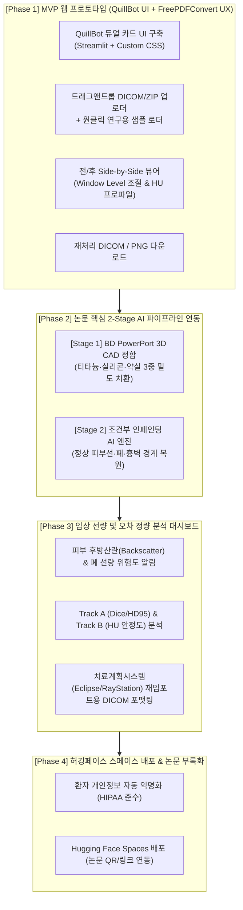

# [개발 계획서] ChemoPort CT-MAR 웹 플랫폼 단계별 개발 로드맵

본 문서는 [[논문 계획서] chemo_port_retrospective_dosimetry_paper_plan.md](file:///Users/shinwookkim/Documents/Personal%20Stuff/%EB%85%BC%EB%AC%B8/Artifacts/ChemoPort/chemo_port_retrospective_dosimetry_paper_plan.md)의 핵심 연구 방법론(제조사 CAD Prior 2-Stage AI 복원 및 선량 재평가)을 임상 연구 및 오픈 사이언스 데모로 실현하기 위한 **단계별 웹 애플리케이션 개발 계획서**입니다.

---

## 1. 프로젝트 비전 및 디자인 컨셉

* **서비스 명칭:** **ChemoPort CT-MAR Studio**
* **핵심 역할:**
  1. **연구진 워크플로우 도구:** 환자 CT(DICOM) 업로드 ➔ 2-Stage AI MAR 자동 복원 ➔ 선량 왜곡 위험도 평가 ➔ 치료계획시스템(TPS)용 DICOM 재익스포트.
  2. **오픈 사이언스 & 논문 부록(Supplement):** 허깅페이스 스페이스(Hugging Face Spaces)에 공개 배포하여 논문 심사위원 및 전 세계 연구자가 직접 체감할 수 있는 인터랙티브 라이브 데모.
* **디자인 및 UX 레퍼런스:**
  * **UI 스타일 (QuillBot 감성):** 깔끔한 화이트/민트/틸 톤의 카드형 2-패널 레이아웃, 직관적인 탭 네비게이션, 모던한 라운드 박스 디자인.
  * **UX 플로우 (FreePDFConvert 감성):** 드래그 앤 드롭 업로드 ➔ 원클릭 고속 재처리 ➔ 전/후 비교(Side-by-Side) ➔ 원클릭 결과 다운로드.

---

## 2. 전체 개발 파이프라인 아키텍처



---

## 3. 단계별 세부 개발 계획

### [Phase 1] MVP 웹 프로토타입 구축 (UI/UX 프레임워크 완성) — ✅ 완료 (Completed)
* **목표:** 실제 동작하는 배포 가능한 프론트엔드 및 기본 인터랙션 틀을 완성하여 즉시 테스트 가능한 1차 빌드 산출.
* **주요 개발 내용 및 완료 현황:**
  1. **QuillBot 스타일 Custom CSS 테마 개발:** ✅ 완료
     * 맑고 신뢰감을 주는 딥 틸(Deep Teal `#0d9488`) & 민트 브랜드 컬러 시스템 구축.
     * Liquid Glass 카드형 모듈, 반응형 레이아웃, Apple SF Pro 기반 타이포그래피.
  2. **FreePDFConvert 스타일 4-단계 워크플로우:** ✅ 완료
     * 1단계(Image Loading) ➔ 2단계(Artifact Inspection) ➔ 3단계(AI Correction) ➔ 4단계(Save & Export) 원클릭 진행 구조.
     * 대용량 DICOM ZIP 및 단일 DCM 업로더 (최대 1GB, 단일 시리즈 유효성 검증).
     * 데이터가 없는 방문자를 위한 "원클릭 연구용 샘플 케모포트 CT 로드" 기능.
  3. **의료영상 뷰어 & 비교 도구 (RTP Inspection Glass & WL/WW):** ✅ 완료
     * 마우스 휠 기반 120 FPS 제로-랙(Zero-lag) 클라이언트 사이드 슬라이스 탐색.
     * 5개 의료용 윈도우 프리셋 (Soft Tissue, Bone, Lung, Metal, All HU full dynamic range) 및 우클릭 드래그 실시간 WL/WW 조절.
     * 방사선종양학 RTP 스타일 **인터랙티브 Glass 도구** (S: 75px, M: 160px, L: 240px 크기 조절, 내부 Original CT / 외부 Reconstructed CT 비교).
     * 하단 일체형 조작 가이드 (`viewer-footer-hint`) 2번 및 3번 통일.
  4. **결과 다운로드 & 익스포트 (Step 4):** ✅ 완료
     * TPS 호환성 유지 DICOM 메타데이터 보존 및 개별 DCM / 일괄 ZIP 압축 다운로드.
     * 고해상도 전후 비교 PNG 및 JSON 진단 리포트 생성.

---

### [Phase 2] 2-Stage CAD Prior AI 복원 파이프라인 연동 (핵심 엔진) — 🚀 진행 중 (Active)
* **목표:** 논문 계획서 제3장(3.2~3.3)의 제조사 CAD Prior 기반 2-Stage 복원 알고리즘을 독립 모듈화하고 웹 백엔드 엔진에 연동.
* **주요 개발 내용:**
  1. **Stage 1 (CAD Prior 3D 정합 및 다중 물리밀도 강제 치환):**
     * 제조사 기술 규격(*BD PowerPort® Titanium*) 기반 파라메트릭 3D CAD Prior 템플릿 구현 (`modules/cad_matching.py`).
     * 외벽 티타늄($\rho = 4.43\text{ g/cm}^3$, $\sim 5,000–8,000\text{ HU}$), 실리콘 셉텀($\rho = 1.15\text{ g/cm}^3$, $\sim 100–150\text{ HU}$), 내부 약실 챔버($\rho = 1.0\text{ g/cm}^3$, $\sim 0–40\text{ HU}$) 3중 구획 분리.
     * 환자 CT 영상 내 고밀도 금속 영역 자동 탐지 및 중심점/주축(Principal Axes) 기반 위치·자세 정합(Pose Estimation).
     * 번진 금속 인공음영 영역 내에서 포트 내부를 실제 물리적 밀도로 치환하여 포트 내부 선량 왜곡의 근본 원인 해결.
  2. **Stage 2 (해부학적 경계 보존 조건부 인페인팅 AI 엔진):**
     * 조건부 인페인팅 엔진 구현 (`modules/inpainting_engine.py`).
     * 포트 외벽 경계(Inner boundary)와 정상 인체 해부학(Outer boundary: 피부 표면, 늑골, 폐 실질 경계)을 조건으로 주입.
     * 암영(Dark streak) 및 섬광(Bright streak)을 분리 검출하고, 주변 정상 연부조직과 흉벽 근육선, 쇄골상부 림프절(SCN Level II/III) 경계를 해부학적 연속성에 맞게 복원.
     * **심장 및 종격동(Heart & Mediastinum) 방사상 스트릭 완벽 제거:** 케모포트로부터 폐를 가로질러 심장 실질 및 심실/심방 내부로 파고드는 치명적인 광자결핍 암영 줄무늬 및 고감쇠 섬광을 자동 분리·인페인팅. 관상동맥 석회화(Coronary calcification) 및 심장 외연부는 100% 보존.
  3. **파이프라인 통합 및 웹 실시간 최적화:**
     * `modules/reconstruction.py`에서 Stage 1 + Stage 2 파이프라인을 체계적으로 조율 (슬라이스당 ~23ms 초고속 처리).
     * 다중 슬라이스 고속 연산(Vectorized / Multi-slice Caching) 및 Hugging Face CPU 환경 2~4초 이내 처리 최적화.
     * 웹 화면(Step 2)에 텍스트 뱃지 없는 깔끔한 다중 컬러 컨투어(Rose Red: ChemoPort, Amber Yellow: Artifact) 및 HUD 토글 연동.
     * 웹 화면(Step 3)에 Stage 1(CAD Prior 정합 상태) 및 Stage 2(해부학적 복원 지표) 상태 피드백 연동.

---

### [Phase 3] 임상 선량 및 오차 정량 분석 대시보드 확장 (Paper Evaluation Tools)
* **목표:** 논문 계획서 제4장(정량적 평가 지표)의 연구 결과를 웹 상에서 시각적·정량적으로 증명.
* **주요 개발 내용:**
  1. **HU 라인 프로파일 (Line Profile) 실시간 분석:**
     * 사용자가 케모포트 주변에 관심 선(Profile Line)을 그으면 원본 CT와 복원 CT의 HU 변화 그래프를 즉시 렌더링.
     * 금속 줄무늬로 인한 급격한 HU 왜곡이 평탄화된 정도를 직관적으로 비교.
  2. **임상 위험도 경고 및 지표 패널:**
     * **피부 후방산란(Skin Backscatter) 주의 구역:** 포트 직상방 피부 두께 복원 전후를 비교하여 피부 과선량 위험 알림.
     * **폐-흉벽 계면 왜곡도:** 동측 폐(Ipsilateral lung) 윤곽 왜곡 복원도 산출.
     * **표적 윤곽 일치도 (Track A):** Dice Similarity Coefficient(DSC) 및 95% Hausdorff Distance(HD95) 계산기 제공.
  3. **TPS(치료계획시스템) 호환성 보장:**
     * Eclipse, RayStation 등 상용 TPS에 그대로 재임포트하여 Frozen Recalculation을 실행할 수 있도록 DICOM-RT 규격 정합(Study/Series UID, Rescale Slope/Intercept 완전 호환).

---

### [Phase 4] 보안/익명화, 허깅페이스 배포 및 논문 부록 패키징
* **목표:** 환자 개인정보 보호를 완벽히 준수하고, 전 세계 누구나 접속할 수 있도록 퍼블릭 배포.
* **주요 개발 내용:**
  1. **완전한 온프레미스/인메모리 보안 처리:**
     * 업로드된 DICOM 헤더에서 환자 성명(Patient Name), 등록번호(Patient ID), 생년월일 등 민감 개인정보(PHI) 자동 마스킹/가명화.
     * 서버 스토리지에 환자 데이터를 영구 저장하지 않는 메모리 기반 파이프라인.
  2. **Hugging Face Spaces 배포 최적화:**
     * `app.py`, `requirements.txt`, `packages.txt`, `README.md`를 허깅페이스 스페이스 규격에 맞춰 구성.
     * 깃허브(GitHub)와의 자동 동기화(Action) 파이프라인 구축.
  3. **논문 부록(Supplement) 연계:**
     * 논문 초록(Abstract) 및 본문에 기재할 서비스 라이브 URL 및 QR 코드 생성.
     * 논문 심사위원(Reviewer)을 위한 Interactive Figure 모드 탑재.

---

## 4. 권장 프로젝트 파일 구조

```text
ChemoPort-MAR-Studio/
├── app.py                      # 메인 Streamlit 웹 애플리케이션
├── requirements.txt            # 파이썬 의존성 패키지 (streamlit, pydicom, numpy, matplotlib 등)
├── README.md                   # Hugging Face Spaces 설정 및 프로젝트 소개
├── assets/
│   ├── style.css               # QuillBot 모던 감성 커스텀 CSS
│   ├── logo.svg                # 서비스 로고 및 아이콘
│   └── cad_models/             # BD PowerPort 3D CAD 메쉬/템플릿
├── modules/
│   ├── dicom_io.py             # DICOM 파싱, 익명화, HU 변환 및 익스포트
│   ├── cad_matching.py         # Stage 1: 6-DoF 위치 추정 및 CAD 밀도 치환
│   ├── inpainting_engine.py    # Stage 2: 조건부 인페인팅 추론 엔진
│   └── dosimetric_metrics.py   # HU 프로파일, 피부선량 위험도, 정량 지표 계산
└── demo_data/
    └── sample_chemoport_ct.dcm # 방문자 원클릭 체험용 익명화 샘플 CT
```
